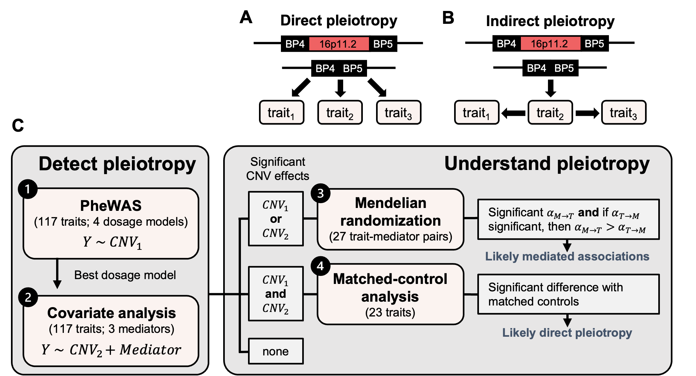

# 16p11.2 BP4-5 pleiotropy analysis
Code repository for *"Disentangling mechanisms behind the pleiotropic effects of proximal 16p11.2 BP4-5 CNVs"*

DOI: 10.1101/2024.03.20.24304613 (https://www.medrxiv.org/content/10.1101/2024.03.20.24304613v1)

**Contact:** Chiara Auwerx (chiara.auwerx -at- unil.ch) or Zoltan Kutalik (zoltan.kutalik -at- unil.ch).

**Summary:** Whereas 16p11.2 BP4-5 copy-number variants (CNVs) represent one of the most pleiotropic etiologies of genomic syndromes in both clinical and population cohorts, the mechanisms leading to such pleiotropy remain understudied. Identifying 73 deletion and 89 duplication carriers among unrelated white British UK Biobank participants, we performed a phenome-wide association study between the region’s copy number and 117 complex traits and diseases, mimicking four dosage models. Forty-six phenotypes (39%) were affected by 16p11.2 BP4-5 CNVs, with the deletion-only, mirror, U-shape, and duplication-only models being the best fit for thirty, ten, four, and two phenotypes, respectively, aligning with the stronger deleteriousness of the deletion. Upon individually adjusting CNV effects for either body mass index (BMI), height, or educational attainment, we found that sixteen testable deletion-driven associations – primarily with cardiovascular and metabolic traits – were BMI-dependent, with educational attainment playing a more subtle role. Bidirectional Mendelian randomization supported that 13 out of these 16 associations (81%) were secondary consequences of the CNV’s impact on BMI. For the 23 traits that remained significantly associated upon individual adjustment for mediators, matched-control analyses found that ten phenotypes, including musculoskeletal traits, liver enzymes, fluid intelligence, platelet count, and pneumonia and acute kidney injury risk, remained associated under strict Bonferroni correction, with eleven additional nominally significant associations. These results paint a complex picture of 16p11.2 BP4-5’s pleiotropic pattern that involves direct effects on multiple physiological systems and indirect co-morbidities consequential to the CNV’s impact on BMI and cognition, acting through trait-specific dosage mechanisms

## Workflow overview:

 **Figure 1: Study workflow.** (**A**) Direct (horizontal) pleiotropy: The CNV causally affects multiple traits through independent mechanisms. (**B**) Indirect (vertical) pleiotropy: The CNV causally impacts trait 2, which in turn causally affects trait 1 and trait 3. The impact of the deletion on trait 1 and trait 3 is thus indirect and mediated by a shared mechanism, i.e., trait 2. For illustration, the 16p11.2 BP4-5 deletion is depicted but the same concept applies to the duplication. (**C**) Overview of the study. The first two analyses aim at detecting and characterizing the pleiotropy of 16p11.2 BP4-5 CNVs through four distinct dosage models that estimate the effect of the CNV on the trait either without (**analysis 1**) or with (**analysis 2**) adjustment for one of three covariates that could potentially mediate the CNV-phenotype association. The second part of the study aims at understanding the mechanisms through which pleiotropy arises. Bidirectional Mendelian randomization was used to investigate the causal relationship between trait-mediator pairs for which the significance of the CNV effect on the trait was affected by adjustment for the mediator (**analysis 3**). Support for mediation was claimed when the forward MR effect of the mediator on the trait is significant and larger than the reverse effect of the trait on the mediator, providing the latter is significant. For traits that showed a significant association with the CNV regardless of covariate adjustment, matched-control analysis, that allows adjustment for all possible mediators simultaneously was performed (**analysis 4**). If the effect remains significant, the association likely reflects genuine horizontal pleiotropy. PheWAS = phenome-wide association study.

## Description of content: 

Each of the folders contain scripts to execute one of the four analyses illustrated in **Figure 1**.

- **01_PheWAS:** Run the phenome-wide association study (PheWAS) to assess the dosage relation between the copy-number state of the 16p11.2 BP4-5 region and 117 quantitative and binary phenotypes, according to four association models.

- **02_covariate_analysis:** Assess the impact of adjusting the PheWAS for either of three putative mediators of the CNV-phenotype relation: BMI, educational attainment, and height.

- **03_Mendelian randomization:** Compute bidirectional Mendelian randomization causal effects between putative mediator and phenotypes pairs. This is done for 27 phenotype-mediator pairs for which the phenotype either gains or loses association with the CNV upon adjustment of the mediator (`02_covariate_analysis`). This allows detection of associations that are likely secondary consequences of the CNV's impact on either of the mediatory traits. Note that the scripts to obtain MR effects (scripts in `01_MR_pipeline`) were adapted from the [UNIL_SGG_MR_LTL](https://github.com/cChiiper/UNIL_SGG_MR_LTL) GitHub repository by Samuel Moix, where more information is available on how to run the scripts.

- **04_matched_control:** Determine which associations remain significant when comparing CNV carriers to matched controls (for age, sex, ancestry, BMI, education, and socioeconomic status), as opposed to the general population (`01_PheWAS:`). This is done for 23 phenotypes that remain significantly associated to the CNV upon individual adjustment for either tested mediator (`02_covariate_analysis`). This allows detection of associations that are likely independent of changes in BMI, education, and socioeconomic status, and thus likely reflect genuine pleiotropy. 

*Note:* Scripts are ordered and often rely on data generated by previous scripts. Scripts have been annotated to describe which script produces files required for a given analysis.

## Data availability: 

Key data are made available as supplementary tables of the manuscript.

